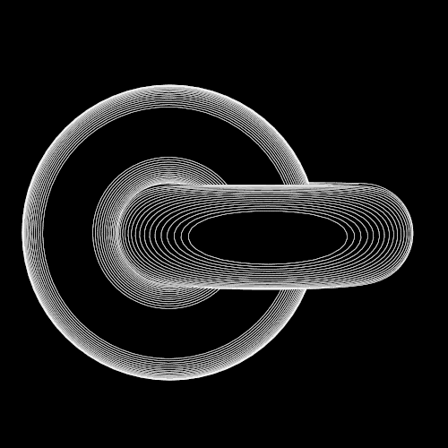

  
   
  

<pre>

┌──┤ WHOAMI ├──────────────────▰▰▰
│
├─▣ Software Engineer
├─▣ Low-Level Programming, Systems, Linux & HPC
│
└───────────────────────────────▰▰▰

┌──┤ SOCIAL ├──────────────────▰▰▰
│
├─◈ <a href="https://www.linkedin.com/in/ahmed-zouine">LinkedIn</a>
├─◈ <a href="https://twitter.com/AHMED_EZZ0UINE">Twitter / X</a>
├─◈ <a href="https://medium.com/@ahmed.ezzouine">Medium</a>
├─◈ <a href="https://g.dev/ahmedez-zouine">Google Developer</a>
├─◈ Discord: goodman
│
└───────────────────────────────▰▰▰

┌──┤ 42 PROJECTS ├─────────────▰▰▰
│
├─◈ <a href="https://github.com/ahmedez-zouine/libft">libft</a>
├─◈ <a href="https://github.com/ahmedez-zouine/get_next_line">get_next_line</a>
├─◈ <a href="https://github.com/ahmedez-zouine/ft_printf">ft_printf</a>
├─◈ <a href="https://github.com/ahmedez-zouine/Born2beRoot">Born2beRoot</a>
├─◈ <a href="https://github.com/ahmedez-zouine/Frac2L">Frac2L</a>
├─◈ <a href="https://github.com/ahmedez-zouine/push_swap">push_swap</a>
├─◈ <a href="https://github.com/ahmedez-zouine/parallels">parallels</a>
├─◈ <a href="https://github.com/ahmedez-zouine/G_cub3D">G_cub3D</a>
├─◈ <a href="https://github.com/ahmedez-zouine/longtalk">longtalk</a>
├─◈ <a href="https://github.com/ahmedez-zouine/Ttway">Ttway</a>
│
└───────────────────────────────▰▰▰

┌──┤ ALX PROJECTS ├────────────▰▰▰
│
├─◈ <a href="https://github.com/ahmedez-zouine/alx-low_level_programming">alx low level programming</a>
├─◈ <a href="https://github.com/ahmedez-zouine/alx-higher_level_programming">alx higher level programming</a>
├─◈ <a href="https://github.com/ahmedez-zouine/Fix_My_Code_Challenge">Fix My Code Challenges</a>
├─◈ <a href="https://github.com/ahmedez-zouine/AirBnB_clone">AirBnB clone Project</a>
├─◈ <a href="https://github.com/ahmedez-zouine/Sort_Algorithms">Sort Algorithms</a>
├─◈ <a href="https://github.com/ahmedez-zouine/alx-frontend-javascript">alx Frontend Javascript</a>
├─◈ <a href="https://github.com/ahmedez-zouine/alx-interview">alx Interview</a>
│
└───────────────────────────────▰▰▰

┌──┤ SYSTEMS & HPC ├───────────▰▰▰
│
├─◈ <a href="https://github.com/ahmedez-zouine/LAB_MPI-Tracing-Causality-Analysis">LAB_MPI-Tracing-Causality-Analysis</a>
├─◈ <a href="https://github.com/ahmedez-zouine/kvm-ubuntu-iptables">kvm-ubuntu-iptables</a>
│
└───────────────────────────────▰▰▰
